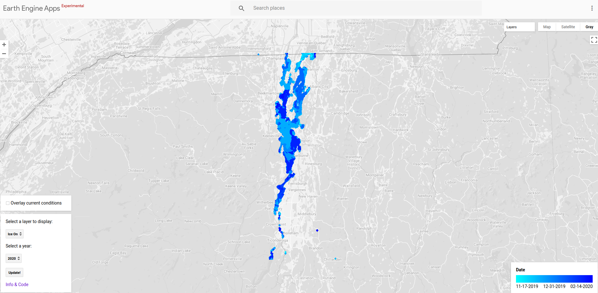
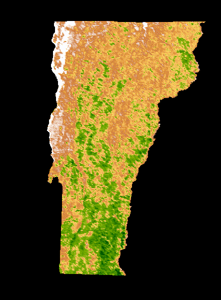

# Projects 

This page is still under construction! A handful of my projects are on [Github](https://github.com/abigailstone/).


- I'm working on a Google Earth Engine web app to explore ice coverage and historical ice-on and ice-off dates on Lake Champlain, using Sentinel-1 C-band SAR imagery. [[Gee App](https://astone.users.earthengine.app/view/champlain-ice)] [[code](https://github.com/abigailstone/champlain-ice)]

```{r  out.width = "75%", echo=FALSE}
library(knitr)
 
```

- Since static images are boring, here's an animated NDVI (Normalized Difference Vegetation Index) over the state of Vermont, 2018-2019. [[dataset](https://developers.google.com/earth-engine/datasets/catalog/MODIS_006_MOD13A2)][[code](https://github.com/abigailstone/procrasti-mapping/blob/main/GEECodeEditor/ndviAnimation.js)]

```{r  out.width = "30%", echo=FALSE}
library(knitr)
 
```